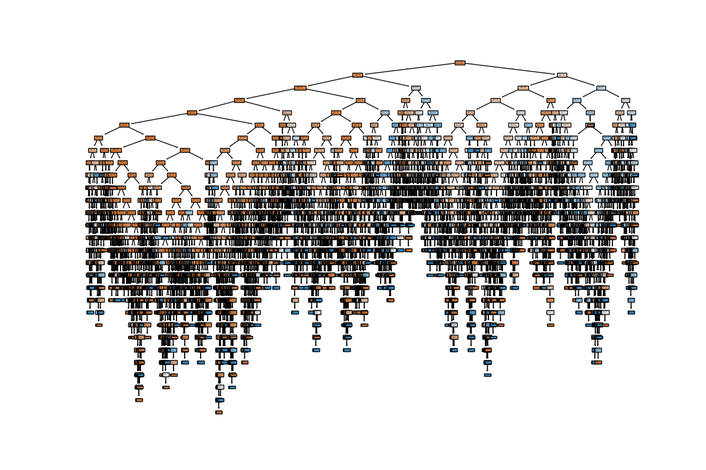

# PRODIGY_DS_03

## 📌 Internship Track
Data Science Internship at Prodigy InfoTech

---

## 📊 Task Objective
To build a Decision Tree Classifier that predicts whether a customer will purchase a product or service based on demographic and behavioral data.

---

## 📁 Dataset
Bank Marketing Dataset (Provided by Prodigy InfoTech)

The dataset contains information about customers such as:
- Age
- Job
- Marital status
- Education
- Contact details
- Campaign information
- Previous outcomes

Target Variable:
- **y** → Indicates whether the customer subscribed (Yes/No)

---

## 🧹 Data Preprocessing

- Loaded dataset using Pandas
- Verified dataset structure and data types
- Applied **Label Encoding** to convert categorical variables into numerical format
- Prepared dataset for machine learning model

---

## 🤖 Model Building

- Used **Decision Tree Classifier** from Scikit-learn
- Split dataset into:
  - Training set (80%)
  - Testing set (20%)
- Trained model on training data
- Predicted results on test data

---

## 📈 Model Evaluation

- Evaluated model performance using **Accuracy Score**
- Model Accuracy: 87.31%
- The model successfully learned patterns in customer behavior

---

## 🌳 Decision Tree Visualization

The trained decision tree model is visualized below:

---

## 🔍 Key Insights

- Customer demographics and past interactions influence purchase decisions
- Decision Tree helps in understanding decision-making paths clearly
- Feature relationships can be interpreted visually using tree structure

---

## 🛠 Tools & Technologies

- Python
- Pandas
- Scikit-learn
- Matplotlib

---

## 📂 Project Structure

PRODIGY_DS_03/

│

├── data/

│ └── bank.csv

│

├── notebooks/

│ └── task3_decision_tree.ipynb

│

├── outputs/

│ └── decision_tree.png

│

└── README.md

---

## ✅ Conclusion

This project demonstrates how machine learning models like Decision Trees can be used to predict customer behavior. It highlights the importance of data preprocessing, feature transformation, and model evaluation in building effective predictive systems.

---

## 👤 Author
Gokul S
